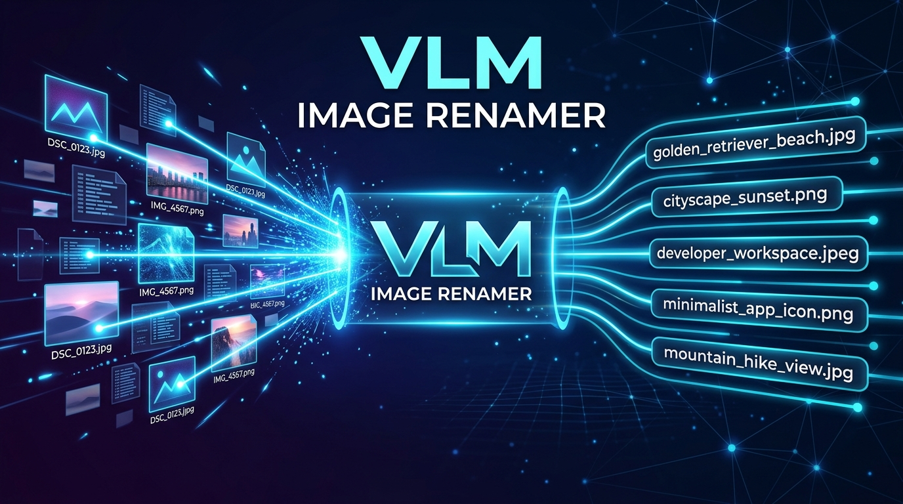
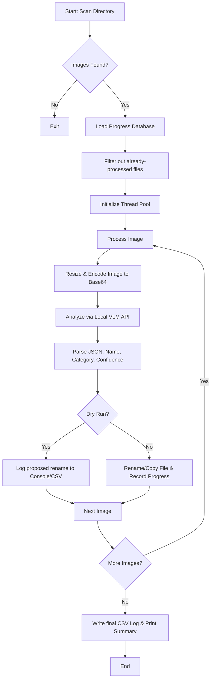

# 🧠 VLM Image Renamer (v1.5)



An intelligent, local VLM-powered image renamer that turns chaotic, unstructured image directories into descriptive, search-optimized `snake_case` filenames. Powered by Qwen-VL (or any vision-language model) hosted locally via **LM Studio**.

---


---

## 📖 Overview

Standard batch renamers rely on metadata or timestamps (e.g., `IMG_4821.jpg` or `screenshot_2026-07-05.png`), leaving your directories unsearchable. **VLM Image Renamer** solves this by leveraging a Local Vision-Language Model (VLM) to "look" at each image, read any overlay text, identify the subjects, and rename the file accordingly.

### 🌟 Key Enhancements in v1.5
* **Text-First Intelligence**: Prioritizes scanning and transcribing readable text (memes, signs, slides, code errors) before describing visual elements.
* **Qwen-VL Optimization**: Engineered prompt structure with thinking mode disabled for maximum throughput.
* **Parallel Worker Threads**: Leverages a thread pool for parallel requests (great for multi-GPU setups or fast servers).
* **Resume Support**: Tracks progress in a local `.renamer_progress.json` database. If a run is interrupted, it picks up exactly where it left off.
* **Dry-Run Mode**: Preview proposed filename changes without modifying any files on disk.
* **Auto-Resizing & Budgeting**: Smart image pre-processing downscales large files incrementally to fit model token budgets, preventing context overflows.
* **Comprehensive Logging**: Generates both standard execution logs (`renamer.log`) and structured audit sheets (`renamer_log.csv`) for easy reviews or rollbacks.

---

## ⚙️ How It Works



---

## 🚀 Quick Start

### 1. Prerequisites
Ensure you have Python 3.9+ installed. Then install the required dependencies:

```bash
pip install openai Pillow tqdm
```

### 2. Set Up Your Local VLM
1. Download and run [LM Studio](https://lmstudio.ai/).
2. Search and download a vision model (e.g., **Qwen2.5-VL-7B-Instruct** or **Qwen3-VL**).
3. Start the local server in LM Studio (default: `http://localhost:1234`).
4. Ensure the server's endpoint matches the configuration.

### 3. Usage
Run the script by pointing it to a directory of images:

```bash
# Rename files in-place (skips already-processed files automatically)
python "Renamer v1.5.py" "/path/to/your/images"

# Run a dry-run first to preview proposed filenames
python "Renamer v1.5.py" "/path/to/your/images" --dry-run

# Copy renamed files to a new directory instead of changing them in-place
python "Renamer v1.5.py" "/path/to/your/images" --output-dir "/path/to/destination"

# Recurse into subdirectories and prepend categories (e.g., photo_dog.jpg)
python "Renamer v1.5.py" "/path/to/your/images" --recursive --prefix
```

---

## 📝 Naming Strategies

The model follows a strict prioritization hierarchy to create descriptive filenames:

| Image Context | Naming Strategy | Original File | Resulting Filename |
| :--- | :--- | :--- | :--- |
| **Memes & Subtitles** | `[Meme Subject] + [Overlay Text]` | `unnamed (2).png` | `drake_meme_avoiding_work_on_reddit.jpg` |
| **Text Documents** | `[Doc Type] + [Header/Key Title]` | `scan_884.pdf` | `mcdonalds_receipt_total_1499.jpg` |
| **Code / Screenshots** | `[Platform/App] + [Error Message]` | `temp.png` | `typeerror_cannot_read_property_undefined.png` |
| **Photos (No Text)** | `[Subject] + [Action] + [Setting]` | `DSC_0012.jpg` | `golden_retriever_running_on_beach.jpg` |
| **Food & Products** | `[Specific Dish] + [Key Ingredients]` | `IMG_992.heic` | `birria_tacos_consomme_dipping.jpg` |

---

## 🔧 Configuration (`renamer.toml`)

Create a `renamer.toml` file in the same directory as the script to persist your custom configurations:

```toml
# VLM Image Renamer Settings
lm_studio_url = "http://localhost:1234/v1"
lm_studio_key = "lm-studio"
model_name    = "qwen3-vl"       # Must match the model name loaded in LM Studio
workers       = 1                # Increase only if running a powerful multi-instance GPU backend
max_retries   = 4
base_delay    = 1.5
token_budget  = 2048             # Limits maximum tokens to keep requests fast
dry_run       = false
recursive     = false
add_prefix    = false            # Set true to prepend categories: [category]_name.jpg
resume        = true             # Skip already processed files
write_csv_log = true
log_file      = "renamer.log"
csv_file      = "renamer_log.csv"
```

---

## 🛠️ CLI Reference

```txt
positional arguments:
  folder                Path to the folder containing images to rename.

optional arguments:
  -h, --help            show this help message and exit

Model / connection:
  --model NAME          LM Studio model name override.
  --url URL             LM Studio base URL override (default: http://localhost:1234/v1).
  --workers N           Parallel worker threads. Default is 1.

Behaviour:
  --dry-run             Preview renames without changing any files.
  --recursive           Recurse into subdirectories.
  --prefix              Prepend the detected category to each filename.
  --output-dir DIR      Copy renamed files into DIR instead of renaming in-place.

Resume control:
  --fresh               Delete the progress file and reprocess every image from scratch.
  --no-resume           Ignore the progress file for this run without deleting it.

Config:
  --config FILE         Path to TOML config file (default: renamer.toml).
```

---

## 📄 License
This project is open-source and available under the **MIT License**.
